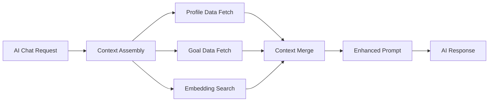

# AI Context Integration Design

## User Story
As a user, I expect the AI Coach to leverage all the profile information I've provided to give me truly personalized, context-aware advice, plans, and motivation.

## Acceptance Criteria

1. **Profile Data Integration**
   - AI has access to complete user profile
   - All goals are included in context
   - Equipment availability considered
   - Physical limitations respected
   - Preferences influence recommendations

2. **Embedding System**
   - Profile text content converted to embeddings
   - Goal descriptions vectorized
   - Semantic search for relevant context
   - Efficient storage and retrieval
   - Real-time updates when data changes

3. **Context Assembly**
   - Dynamic context generation per request
   - Relevant profile sections included
   - Goal-specific information prioritized
   - Historical context when applicable
   - Contextual memory management

4. **AI Coach Enhancement**
   - Personalized system prompts
   - Context-aware responses
   - Goal-oriented conversations
   - Progress acknowledgment
   - Limitation-aware suggestions

## Technical Architecture

### Context Provider System
```typescript
interface AIContext {
  userProfile: ProfileContext;
  activeGoals: GoalContext[];
  capabilities: CapabilityContext;
  limitations: LimitationContext;
  preferences: PreferenceContext;
  history: HistoryContext;
}

interface ProfileContext {
  basic: {
    name: string;
    age: number;
    experience: ExperienceLevel;
    aboutMe: string;
  };
  physical: {
    height?: number;
    weight?: number;
    limitations: string[];
  };
  preferences: {
    activities: string[];
    motivation: string[];
    schedule: SchedulePreference;
  };
}

interface GoalContext {
  id: string;
  type: GoalType;
  description: string;
  target: GoalTarget;
  priority: number;
  progress: GoalProgress;
  timeline: GoalTimeline;
}
```

### Embedding Pipeline
```typescript
interface EmbeddingPipeline {
  // Generate embeddings for text content
  generateEmbedding(text: string): Promise<number[]>;

  // Store embeddings with metadata
  storeEmbedding(
    userId: string,
    contentType: string,
    content: string,
    embedding: number[],
    metadata: Record<string, any>
  ): Promise<void>;

  // Search for relevant context
  searchSimilar(
    query: string,
    userId: string,
    limit: number
  ): Promise<SimilarityResult[]>;

  // Update embeddings when content changes
  updateEmbeddings(
    userId: string,
    changes: ContentChange[]
  ): Promise<void>;
}
```

### Context Assembly
```typescript
interface ContextAssembler {
  // Build complete context for AI request
  assembleContext(
    userId: string,
    requestType: 'workout' | 'nutrition' | 'general',
    query?: string
  ): Promise<AIContext>;

  // Get goal-specific context
  getGoalContext(
    userId: string,
    goalId?: string
  ): Promise<GoalContext[]>;

  // Get capability context based on equipment/limitations
  getCapabilityContext(
    userId: string
  ): Promise<CapabilityContext>;
}
```

## API Specifications

### Profile Embeddings Endpoint
```typescript
// POST /api/profile/embeddings
interface EmbeddingRequest {
  userId: string;
  contentType: 'profile' | 'goal' | 'preference';
  content: string;
  metadata?: Record<string, any>;
  update?: boolean;
}

interface EmbeddingResponse {
  success: boolean;
  embeddingId: string;
  dimensions: number;
  stored: boolean;
}
```

### Context Retrieval Endpoint
```typescript
// GET /api/ai/context
interface ContextRequest {
  requestType: 'workout' | 'nutrition' | 'general';
  query?: string;
  includeHistory?: boolean;
  goalFocus?: string; // specific goal ID
}

interface ContextResponse {
  context: AIContext;
  relevantEmbeddings: SimilarityResult[];
  assemblyMetadata: {
    profileVersion: string;
    goalsCount: number;
    contextSize: number;
    generatedAt: string;
  };
}
```

### AI Chat Enhancement
```typescript
// POST /api/ai/chat
interface EnhancedChatRequest {
  message: string;
  context?: {
    includeProfile: boolean;
    includeGoals: boolean;
    focusGoal?: string;
    requestType?: string;
  };
  conversationId?: string;
}

interface EnhancedChatResponse {
  response: string;
  contextUsed: {
    profileData: boolean;
    goalsReferenced: string[];
    limitationsConsidered: string[];
    equipmentMentioned: string[];
  };
  recommendations?: AIRecommendation[];
  followUpQuestions?: string[];
}
```

## Implementation Strategy

### Phase 1: Embedding Infrastructure
1. **Database Schema Updates**
   - Ensure profile_embeddings table exists
   - Ensure goal_embeddings table exists
   - Add indexes for vector similarity search
   - Create embedding metadata structure

2. **Embedding Generation Service**
   - Text preprocessing pipeline
   - OpenAI/Google AI integration
   - Batch processing capabilities
   - Error handling and retries

3. **Storage and Retrieval**
   - Vector similarity search
   - Metadata filtering
   - Performance optimization
   - Caching strategies

### Phase 2: Context Assembly
1. **Profile Context Builder**
   - Structured data extraction
   - Text content prioritization
   - Preference mapping
   - Limitation parsing

2. **Goal Context Builder**
   - Active goal prioritization
   - Progress calculation
   - Timeline awareness
   - Achievement tracking

3. **Capability Assessment**
   - Equipment-based capabilities
   - Limitation-based restrictions
   - Experience-level considerations
   - Preference-based filtering

### Phase 3: AI Integration
1. **Enhanced System Prompts**
   - Dynamic prompt generation
   - Context injection
   - Persona customization
   - Goal-oriented instructions

2. **Response Enhancement**
   - Context-aware generation
   - Personalized recommendations
   - Progress acknowledgment
   - Motivational messaging

3. **Memory and Continuity**
   - Conversation history
   - Progress tracking
   - Relationship building
   - Long-term consistency

## Data Flow

### Profile Update → Embedding Update


### AI Request → Context Assembly


## Performance Considerations

### Embedding Generation
- **Batch Processing**: Group multiple embeddings
- **Async Operations**: Non-blocking embedding generation
- **Caching**: Cache frequently accessed embeddings
- **Incremental Updates**: Only update changed content

### Context Assembly
- **Smart Caching**: Cache assembled contexts
- **Lazy Loading**: Load context sections on demand
- **Compression**: Compress large context objects
- **TTL Management**: Expire stale contexts

### Vector Search
- **Index Optimization**: Proper vector indexes
- **Query Optimization**: Efficient similarity queries
- **Result Caching**: Cache search results
- **Pagination**: Limit result sets

## Security and Privacy

### Data Protection
- **Encryption**: Encrypt sensitive profile data
- **Access Control**: Strict user isolation
- **Audit Logging**: Track data access
- **Data Minimization**: Only use necessary data

### AI Safety
- **Content Filtering**: Filter sensitive inputs
- **Response Validation**: Validate AI outputs
- **Bias Detection**: Monitor for biased responses
- **Safety Guardrails**: Prevent harmful advice

## Monitoring and Analytics

### Performance Metrics
- **Embedding Generation Time**: < 500ms per text
- **Context Assembly Time**: < 200ms
- **Vector Search Time**: < 100ms
- **AI Response Quality**: User satisfaction scores

### Usage Analytics
- **Context Usage Patterns**: What data is most valuable
- **Goal Reference Frequency**: Which goals are discussed most
- **Personalization Effectiveness**: Response relevance scores
- **User Engagement**: Conversation length and depth

## Testing Strategy

### Unit Tests
- Embedding generation accuracy
- Context assembly completeness
- Vector search precision
- Data privacy compliance

### Integration Tests
- End-to-end context flow
- AI response quality
- Performance benchmarks
- Error handling

### User Acceptance Tests
- Personalization effectiveness
- Goal-aware conversations
- Limitation respect
- Preference adherence

## Success Criteria

### Technical Metrics
- ✅ 95% embedding generation success rate
- ✅ < 500ms total context assembly time
- ✅ > 90% vector search accuracy
- ✅ Zero data leakage between users

### User Experience Metrics
- ✅ 90% users notice personalization
- ✅ 80% find AI advice relevant to goals
- ✅ 95% feel limitations are respected
- ✅ 85% report improved motivation

### Business Metrics
- ✅ 25% increase in AI engagement
- ✅ 40% increase in goal completion
- ✅ 30% reduction in generic responses
- ✅ 20% increase in user retention